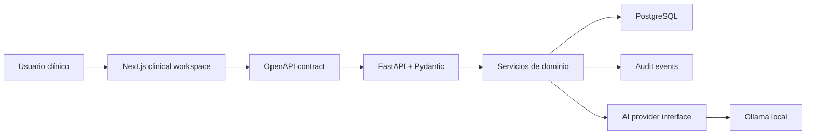

# Arquitectura

OneEpis usa un monorepo pequeño para mantener juntas las piezas que cambian en pareja.

## Capas

- `apps/web`: experiencia clínica, componentes shadcn/ui, composición visual y consumo de OpenAPI.
- `apps/api`: dominio clínico, validación Pydantic, persistencia SQLAlchemy, migraciones Alembic y auditoría.
- `packages/contracts`: contrato OpenAPI exportado desde FastAPI.
- `infra`: dependencias locales de desarrollo.

## Principios

- El backend define la verdad clínica.
- El frontend optimiza la lectura y captura, pero no inventa estructuras clínicas no representadas en la API.
- La IA es un módulo auxiliar, no una autoridad clínica.
- Cada feature nueva debe entrar por un contrato explícito: modelo, schema, ruta, prueba y documentación mínima.

## Flujo de Datos

## Dominios Actuales

- Pacientes: datos mínimos y trazables.
- Ficha clínica: entradas clínicas, signos vitales, alergias, medicación y problemas activos.
- Encuentros: puente entre consulta, hospitalizacion y documentos clinicos.
- Eventos clinicos: hechos longitudinales para timeline, AI-Chart y borradores.
- Hospitalizacion: camas, hojas diarias, rondas de lectura e indicaciones borrador.
- Consulta: atencion ambulatoria minima sobre encuentro y SOAP.
- Papel: proyecciones imprimibles, nunca fuente de verdad.
- Auditoría: eventos de cambios relevantes.
- IA: reglas locales, AI-Chart y proveedor local Ollama configurable como mejora opcional.
